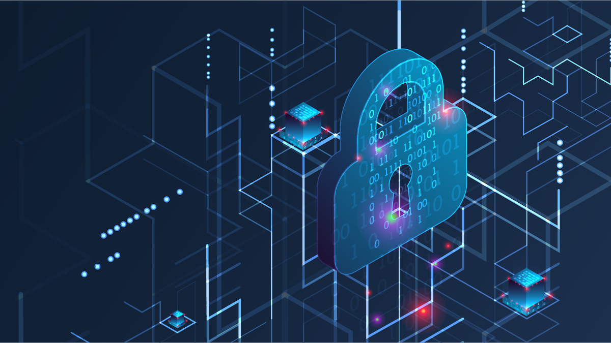
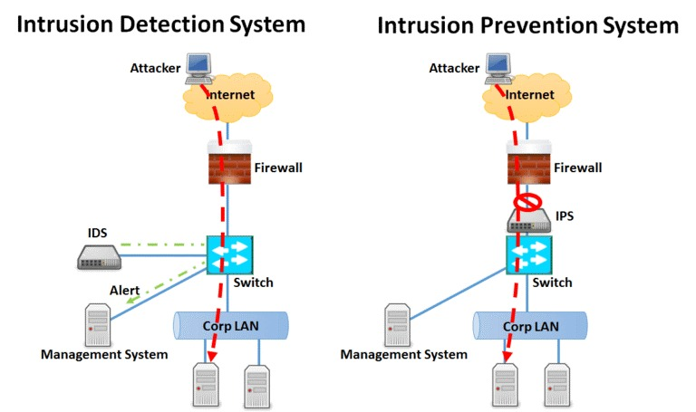
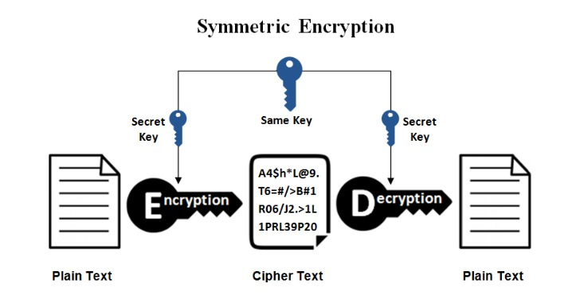

# Açık Kaynak Araçlar İle Ağ Güvenliği Vize Ödevi

### Ödev Raporu

Raporu İndir [DOCX](Açık-Kaynak-Araçlar-İle-Ağ-Güvenliği-Vize.docx)

<iframe width=700, height=650 frameBorder=0 src="Açık-Kaynak-Araçlar-İle-Ağ-Güvenliği-Vize.html"></iframe>

---

### 1-Ağ Güvenliği Nedir?

Ağ güvenliği, bilgisayar ağlarının ve iletişim sistemlerinin korunması amacıyla alınan tedbirleri içeren bir disiplindir. Temel olarak, ağ güvenliği, yetkisiz erişim, veri sızıntısı, hizmet kesintisi ve diğer potansiyel tehditlere karşı ağ altyapısını korumayı amaçlar. Ağ güvenliği, kuruluşların veya bireylerin bilgisayar ağlarını, sistemlerini ve verilerini güvenli tutmalarını sağlamak için bir dizi teknik, yönetimsel ve fiziksel önlemleri içerir.

---

### 2-Ağ Güvenliği Nasıl Sağlanır?

Firewall Kullanımı: Bilgisayar ağlarına gelen ve giden trafiği kontrol etmek, filtrelemek ve yönlendirmek amacıyla firewall kullanmak ağ güvenliği için temel bir önlemdir. Firewall, belirli kriterlere dayanarak trafiği izin verilen veya engellenen paketlere ayırır.
   
   • Antivirüs ve Antimalware Yazılımları: Bilgisayar ağlarını, sunucuları ve kullanıcı cihazlarını zararlı yazılımlardan korumak için antivirüs ve antimalware yazılımları kullanılır. Bu yazılımlar, bilgisayar sistemlerini kötü amaçlı yazılımlara karşı düzenli olarak tarar ve temizler.  
   
   • Güvenlik Duvarları ve VPN (Virtual Private Network): Güvenlik duvarları, ağ trafiğini kontrol etmenin yanı sıra, VPN gibi teknolojiler de kullanılarak iletişimi şifreleyerek güvenli bir bağlantı sağlar. Bu, verilerin güvenli bir şekilde iletilmesini sağlar.
   
   • Güvenli Şifre Politikaları: Kullanıcıların güçlü ve düzenli olarak değiştirilen şifreler kullanmalarını sağlamak, ağ güvenliği için önemlidir. Ayrıca, çok faktörlü kimlik doğrulama gibi ek güvenlik katmanları da uygulanabilir.
   
   • Güvenlik Güncelleştirmeleri: Sistemlerin ve yazılımların düzenli olarak güncellenmesi, bilinen güvenlik açıklarını kapatmak ve yeni tehditlere karşı korunmak için önemlidir. Bu, yazılım ve donanım sağlayıcılarının yayınladığı güvenlik güncelleştirmelerini düzenli olarak uygulamayı içerir.
   
   • İzleme ve Günlük Tutma: Ağ trafiğini izlemek, güvenlik olaylarını belirlemek ve günlük tutmak, potansiyel tehditleri önceden tespit etmeye yardımcı olur. Bu sayede, güvenlik olayları daha hızlı bir şekilde ele alınabilir.
   
   • Eğitim ve Farkındalık: Kullanıcıları, ağ güvenliği konusunda eğitmek ve farkındalık oluşturmak da önemlidir. Kullanıcıların sosyal mühendislik saldırılarına karşı dikkatli olmalarını sağlamak, güvenlik bilincini artırır.
---

### 3-İşletmeler İçin Ağ Güvenliği Neden Önemlidir?

İşletmeler için ağ güvenliği büyük bir öneme sahiptir. Bu nedenler arasında şunlar bulunmaktadır:

3.1	Veri Koruma: İşletmeler, müşteri bilgileri, finansal veriler, iş süreçleri ve diğer duyarlı bilgileri barındırır. Ağ güvenliği, bu verilerin yetkisiz erişimden, sızıntılardan veya manipülasyonlardan korunmasını sağlar. Bu, müşteri güvenini artırır ve yasal sorumlulukları yerine getirmek adına önemlidir.

3.2	Operasyonel Süreklilik: Ağ güvenliği, işletmelerin günlük operasyonlarını sürdürebilmesi için kritiktir. Zararlı yazılım saldırıları, veri kaybı veya ağ kesintileri gibi güvenlik ihlalleri, iş sürekliliğini ciddi şekilde etkileyebilir. Güvenli bir ağ, iş sürekliliği planlarının başarıyla uygulanmasına yardımcı olur.

3.3	Müşteri Güveni ve İtibar: Müşteriler, işletmelerine kişisel ve finansal bilgilerini güvenle sağlamak isterler. Bir güvenlik ihlali durumunda müşteri bilgilerinin sızması, müşteri güvenini sarsabilir ve işletmenin itibarını olumsuz etkileyebilir.

3.4	Finansal Kayıpları Önleme: Güvenlik ihlalleri, işletmelere ciddi finansal kayıplara neden olabilir. Veri kaybı, itibar kaybı ve operasyonel kesintiler, işletmelere maliyetli olabilir. Ağ güvenliği, bu tür finansal kayıpları önlemeye yardımcı olur.

3.5	Rekabet Avantajı: Güvenli bir ağ, işletmeye bir rekabet avantajı sağlayabilir. Müşteriler ve iş ortakları, güvenli bir ortamda çalışmak istedikleri için işletmelerin güvenlik önlemlerine olan yatırımını takdir ederler.

3.6	Yasal Uyumluluk: Birçok sektörde, işletmelerin belirli güvenlik standartlarına uymaları yasal bir gerekliliktir. Ağ güvenliği önlemleri, bu standartlara uyumu sağlar ve yasal sorumlulukları yerine getirme konusunda işletmelere yardımcı olur.

3.7	Zararlı Yazılımlara Karşı Koruma: Zararlı yazılım saldırıları, işletmelerin bilgisayar sistemlerini hedef alabilir ve ciddi hasarlara yol açabilir. Ağ güvenliği önlemleri, zararlı yazılımların tespit edilmesini, engellenmesini ve temizlenmesini sağlayarak bu tür tehditlere karşı koruma sağlar.

İşletmeler için ağ güvenliği, hem finansal hem de itibari açıdan kritik bir öneme sahiptir. Güvenli bir ağ, iş sürekliliğini sağlamak, müşteri güvenini kazanmak ve işletmenin rekabet avantajını sürdürmek adına temel bir unsurdur.
---

<!-- paginate: true -->

### 4-Ağ Güvenliği Türleri Nelerdir?

Ağ güvenliği, farklı tehditlere karşı koruma sağlamak amacıyla çeşitli güvenlik önlemlerini içeren geniş bir konsepttir. Ağ güvenliği türleri, farklı tehditlere karşı spesifik koruma sağlamak üzere tasarlanmış çeşitli önlemleri içerir. Ağ güvenliği türlerini şu şekilde sınıflandırabiliriz:

4.1 Firewall Güvenliği

	• Ağ Katmanı (Network Layer) Firewal: IP adresleri ve port numaralarına dayalı trafiği kontrol eder.
	
	• Uygulama Katmanı (Application Layer) Firewall: Uygulama düzeyinde (HTTP, FTP gibi) trafiği kontrol eder.

	• Devre Dışı Bırakma (Stateful) Firewall: Bağlantı durumunu izleyen, trafiği değerlendiren ve buna göre kararlar alan bir firewall türüdür.

4.2 Intrusion Detection System (IDS) ve Intrusion Prevention System (IPS)

	• IDS: Ağda gerçekleşen olayları izleyen ve anormallikleri tespit eden bir sistemdir.

	• IPS: Anormallikleri tespit ettiğinde otomatik olarak önlemler alan, saldırıları engelleyen bir sistemdir.

4.3 Antivirüs ve Antimalware Çözümleri

	• Bilgisayar sistemlerini zararlı yazılımlardan korumak için kullanılır.
	
4.4 VPN (Virtual Private Network) Güvenliği

	• İnternet üzerinden güvenli bir şekilde iletişim sağlamak için şifreleme kullanır.

4.5 Access Control ve Kimlik Yönetimi
	
	• Kullanıcıların ve cihazların ağ kaynaklarına erişimini kontrol eder.
	
	• Kimlik doğrulama ve yetkilendirme mekanizmalarını içerir.

4.6 SSL/TLS Güvenliği

	• İnternet üzerinde güvenli iletişimi sağlamak için kullanılan protokollerdir.

4.7 DLP (Data Loss Prevention)
	
	• Hassas verilerin izinsiz erişimini ve sızmasını önlemek için kullanılır.

4.8 Web Güvenliği

	• Zararlı web sitelerinden ve web tabanlı saldırılardan koruma sağlar.

	• Content Filtering ve URL Filtering gibi mekanizmalar içerir.

4.9 E-posta Güvenliği

	• Zararlı e-posta eklerini ve phishing girişimlerini engellemek için kullanılır.

	• Spam filtreleme, antivirüs taraması gibi özellikleri içerir.

4.10 Biometrik Güvenlik

	• Parmak izi, retinal tarama gibi biyometrik verileri kullanarak kimlik doğrulama sağlar.

4.11 WAF (Web Application Firewall)

	• Web uygulamalarına yönelik güvenlik tehditlerini önlemek için kullanılır.

4.12 Patch Management

	• Sistem ve uygulamalardaki güvenlik açıklarını düzeltmek ve güncellemek için kullanılır.

	• Bu listedekiler, ağ güvenliği alanındaki temel türlerden sadece birkaçıdır. Ağ güvenliği, sürekli gelişen tehditlere karşı koruma sağlamak amacıyla çeşitli yöntem ve teknolojileri içeren dinamik bir alandır. 

---

### 5-Veri Güvenliği En İyi Uygulamaları

Veri güvenliği en iyi uygulamaları, veri ihlali riskini azaltmak ve yasal uyumluluğu sağlamak için hem şirket içinde hem de bulutta kullanılmalıdır. Bazı öneriler değişiklik gösterebilir ancak genellikle detaylı bir savunma yaklaşımı uygulamak için oluşturulmuş katmanlı bir veri güvenliği stratejisi gerekir. Farklı kontroller farklı tehdit vektörlerini azaltır. Belirli çözüm alanları arasında, veritabanı aktivitesini ve tehditleri değerlendirme, tespit etme ve izleme olanakları yer alır.
---

### 6-Veri güvenliğinin önemi

Veri, her organizasyon için en önemli varlıklardan biridir. Bu nedenle, verileri her türlü yetkisiz erişime karşı korumak kritik önem taşır. Veri ihlalleri, başarısız olan denetimler ve yasal gereksinimlere uyulmaması durumunda itibarımız zedelenebilir, marka öz sermayesinde kayıplar yaşanabilir, fikri mülkiyetin gizliliği bozulabilir ve uyumsuzluk nedeniyle cezalarla karşılaşılabilir. Avrupa Birliği Genel Veri Koruma Yönetmeliği (GDPR) uyarınca veri ihlalleri, bir organizasyonların küresel yıllık gelirinin %4'üne kadar para cezalarına neden olabilir. Bu durum, çoğu zaman ciddi mali kayıplara yol açabilir. Hassas veriler kişiyle ilişkilendirilebilir bilgileri, finans bilgilerini, sağlık bilgilerini ve fikri mülkiyeti içerir. Veri ihlallerini önlemeye ve uyumluluğu sağlamaya yardımcı olması için veriler korunmalıdır.
---

### 7-Ağ Güvenliği Önlemleri

Ağ güvenliği önlemleri, gizliliği, bütünlüğü ve kullanılabilirliği korumak adına ağlara eklenen güvenlik kontrolleridir. Bu kontroller sürekli olarak gelişmeye devam ediyor. Ancak bilinmesi gereken bazı önemli şeyler var. Saldırganları ağınızdan uzak tutmak çaba gerektirir. Güvenlik duvarları, proxy'ler ve ağ geçitleri bu amaç için çalışır.

Bu cihazların saldırganları kesinlikle ağınızdan uzak tutacağını varsaymak tehlikelidir. Saldırganlar eninde sonunda içeri girmenin bir yolunu bulur. Tanınmış bir bilgisayar korsanı olan Kevin Mitnick, ağ güvenliklerini test etmesi için kendisinden yardım alan şirketlere karşı sızma testi başlatırken %100 başarılı olduğunu iddia ediyor.

Yani içeri girmenin her zaman bir yolu vardır. Güvenlik, öğrenmek, gelişmek ve bilgisayar korsanlarının bir adım önünde olmak için sürekli çalışmayı gerektirir. Siber korsanlar içeri girdiğinde olay müdahale planlarına ve ekiplerine sahip olmak da çok önemlidir.
---

### 8-Siber-Fiziksel Sistemlerde Güvenliğin Önemi

İş dünyasının dijital dönüşüme büyük oranda entegre olmasıyla kritik varlıklara yönelik siber saldırı tehdidi de artmış durumda. Ciddi şekilde veri ihlali riskiyle karşı karşıya kalan kuruluşların siber güvenlik programlarını siber-fiziksel sistemleri de bünyesine dahil edecek şekilde inşa etmesi gerekiyor.

Geçtiğimiz şubatta bir siber saldırgan Amerika Birleşik Devletleri’nin Florida eyaletindeki bir su arıtma tesisinin bilgisayar sistemine uzaktan erişim sağladı. Saldırgan tesisin su kaynağındaki sodyum hidroksit miktarını tehlikeli seviyeye çıkarmayı denedi. Tesisin BT altyapısında görevli bir operatör sisteme uzaktan erişim yoluyla yapılan izinsiz girişi fark etti. Fakat bu ve bunun gibi olaylar siber ve fiziksel dünyanın kesişiminin kuruluşlar açısından çeşitli tehditler yaratabileceğini gösteriyor.

Siber-fiziksel sistemler veriden daha fazlasını işleyip bireysel süreçlerden BT ekosisteminin tamamına varana kadar fiziksel sonuçları yönetiyor ve optimize ediyor. Tam da bu nedenle CPS (Cyber-Physical Systems) güvenliğini tesis ederken kurumsal BT güvenliğine ek yeni stratejilerden de yararlanmak gerekiyor.

---

### 9-Saldırı Tespit Sistemi (Intrusion Detection System)

Saldırı tespit sitemi (IDS), ağlara, sistemlere veya uygulamalara yapılan kötü niyetli saldırıları, ihlalleri ve bu sistemlerin güvenlik açıklarını tespit etmek için geliştirilmiş bir ağ güvenlik teknolojisidir.

IDS, yanlızca tehditleri tespit etmek için çalışır.Tespit edilen herhangi bir aktivite veya ihlal bir yöneticiye bildirilir veya  bir güvenlik ve olay yönetimi (SIEM) sistemi kullanılarak merkezi olarak toplanır. SIEM sistemlerinde farklı kaynaklardan gelen verileri birleştirir ve filtreleme yaparak kötü niyetli alarmın yanlış alarm olup olmadığını denetler ve ayırır.

IDS, yanlızca dineleme amaçlı yazılım veya cihazdır. Bu sistem trafiği izler ve sonuçlarını bir yöneticiye rapor eder, ancak tespit edilen bir saldırının sistemi ele geçirmesini önlemek için otomatik olarak harekete geçemez. Saldırganlar, güvenlik önlemlerini aşıp ağa girdikten sonra çok hızlı bir şekilde kullanabilirler, böylece IDS, önleme aygıtı için yetersiz bir dağıtım yapar.
---

### 10-Saldırı Önleme Sistemi (Intrusion Prevention System)

Saldırı Önleme Sistemi(IPS), dışarıdan gelecek herhangi bir tehdit veya ihlali tespit ederek buna cevap verir. Saldırıya yanıt verme özellikli bir önleme sistemidir.

IPS, genellikle güvenlik duvarının arkasına oturur ve tehlikeli içerik için bir analiz katmanı sağlar. Trafiği tarayan, tehditlere karşı rapor veren ve bu tehditlere karşı pasif olan IDS’nin aksine IPS kaynak ve hedef arasında bir sıraya yerleştirilir. Burda bütün paketlerin analizini yapar ve otomatik eylemler gerçekleştirir. Bu eylemler şunlardır:
	
	- IDS’de olduğu gibi yöneticiye alarm gönderir.
	
	- Kaynak ve hedef arasındaki ağ trafiğinde tespit edilen kötü paketleri bırakır.
	
	- Kaynak adresin trafiğini engeller.

	- Bağlantıyı sıfırlar. 
	

---

### Ağ Güvenliği Uygulamaları ve Araçları
---

### 11- Güvenlik Duvarı (Firewall)

Firewall'lar, yerel ağınızla dış ağ arasındaki güvenlik kontrol yazılımları/cihazlarıdır. Firewall ilk kurulduğunda bu nokta üzerindeki bütün geçişleri durdurur. Daha önceden belirlenen politikalar dahilinde hangi data paketinin geçip geçmeyeceği, hangi geçişlerde parola doğrulaması yapılacağı gibi bilgiler firewall kural tablolarına eklenir. Bu sayede sisteme ulaşan kişi ve bilgi trafiği kontrol altına alınmış olur. İçerideki/dışarıdaki sistemlere kimlerin girip giremeyeceğine, giren kişilerin hangi bilgisayarları ve hangi servisleri kullanabileceğini firewall üzerindeki kurallar belirler.

Firewall yazılımı, adresler arası dönüştürme-maskeleme(NAT) sayesinde LAN(Local Area Network) deki cihazların IP adreslerini gizleyerek tek bir IP ile dış ağlara erişimini sağlar. Adres saklama ve adres yönlendirme işlemleri firewall üzerinden yapılabilir. Böylece dış dünyadaki kullanıcılar yerel ağdaki kritik topoloji yapısını ve IP bilgisini edinemezler. Firewall yazılımı kendi üzerinde belirtilmiş şüpheli durumlarda sorumluları uyarabilir(e-mail, SNMP, vb.). 
---

### 12-Kriptografi Nedir? Teknikleri Nelerdir?

Kriptografi, düz metni (plain text) çeşitli şifreleme algoritmaları kullanarak şifreli metne (ciphertext) dönüştürerek mesajları okunamayacak şekilde kodlayıp, güvenliği sağlama tekniğidir. Yalnızca amaçlanan kişilerin okuyabileceği ve işleyebileceği şekilde verileri kriptografi teknikleri kullanarak belirli bir biçimde saklama ve iletme yöntemidir. Kriptografi, verileri yalnızca hırsızlık veya değişiklikten korumakla kalmaz, aynı zamanda kullanıcı kimlik doğrulaması için de kullanılabilir. Kriptografi matematiksel teori ve bilgisayar bilimi pratiğine dayanmaktadır.

Bilgisayar biliminde kriptografi, kriptografi teknikleri ile şifreleme algoritmaları kullanılarak mesajları deşifre edilmesi zor yollarla dönüştürmektir. Bunu algoritmalar adı verilen bir dizi kurala bağlı hesaplama ile gerçekleştirir. Bu belirleyici algoritmalar, veri, web, kredi kartı ve e-posta gizliliği sağlamak için kripto grafik anahtar üretimi ve dijital imzalama ve doğrulama yöntemleri kullanılır.

İnternet, sabit diskler ve USB bellekler gibi depolama sistemlerinde şifreleme giderek yaygınlaşıyor çünkü şirketler özel verilerini korumak için daha gelişmiş teknolojilere ihtiyaç duyuyor. Bilgisayar korsanlarının verilerine erişmesini ve bunları kullanmasını önlemek için, kişisel bilgileri işleyen her şirketin mevcut şifreleme algoritmaları kullanan teknolojileri edinmesi gerekir.

Kriptografi Teknikleri

	Simetrik Şifreleme: Simetrik şifreleme bilgileri şifrelemek ve deşifre etmek için yalnızca bir gizli anahtar içeren en basit şifreleme türüdür. Simetrik şifreleme, kriptografi teknikleri ve şifreleme algoritmaları içinde en eski ve en iyi bilinen tekniktir. Bir sayı, bir kelime veya rastgele harfler dizisi olabilen gizli bir anahtar kullanır. Gönderen ve alıcı, tüm mesajları şifrelemek ve şifresini çözmek için kullanılan gizli anahtarı bilmelidir. Blowfish, AES, RC4, DES, RC5 ve RC6 simetrik şifrelemeye örnektir. En yaygın kullanılan simetrik algoritma AES-128, AES-192 ve AES-256'dır.

	
	Asimetrik Şifreleme: Açık anahtar şifrelemesi olarak da bilinen asimetrik şifreleme, verileri şifrelemek ve şifresini çözmek için açık ve özel anahtar çiftleri kullanır. Kriptografi teknikleri arasında en karmaşık tekniktir. Açık anahtar, şifrelemek, özel anahtar ise şifreyi çözmek amacıyla kullanılır. Çiftteki bir anahtar herkesle paylaşılabilir; buna açık anahtar denir. Çiftteki diğer anahtar gizli tutulur; buna özel anahtar denir. Şifreleme algoritmaları, her iki anahtarı da bir mesajı şifrelemek için kullanılabilir. Mesajı şifrelemek için kullanılan anahtarın tersi şifre çözme için kullanılır.

Asimetrik şifrelemenin temelinde bir kriptografi algoritması bulunur. Bu algoritma, bir anahtar çifti oluşturmak için bir anahtar oluşturma protokolü kullanır. Her iki anahtar da matematiksel olarak birbirine bağlıdır. Anahtar çiftleri arasındaki bu ilişki bir şifreleme algoritmaları arasında farklılık gösterir. SSH, OpenPGP, S / MIME ve SSL / TLS gibi birçok protokol şifreleme ve dijital imza işlevleri için asimetrik şifreleme kullanır. Ağ üzerinden güvenli bir bağlantı kurması gereken veya dijital bir imzayı doğrulaması gereken internet tarayıcıları da bu tekniği kullanır.

	Steganografi Tekniği: İçeriği anlaşılamayacak şekilde gizlemeye çalışan şifrelemenin aksine, steganografinin amacı, söz konusu nesne ya da içerikte mevcut olan gerçeği gizlemek için başka bir şey yerleştirerek gizlemektir. Bu bir tür şifreleme kullanmadan gizleme yöntemidir. Amerikan Bağımsızlık Savaşı’nda casuslar bir mektubun satırları arasına sadece ısıtıldığında görülebilen birtakım mesajlar yazdılar. M.Ö 440 yıllarında bir Yunan komutan, bir kölenin saçlarını tıraş ettirip bir mesaj yazdırır ve kölenin saçları uzadığında mesajı alıcıya gönderir. Ünlü ressam Da Vinci’ye ait not defterlerinin birinde gizli bir figür ortaya çıktı.

Bu aslında gizlenmiş bir mesaj değil, çizildikten sonra silinmiş bir insan figürüydü. Ancak bu günümüzde kullanılan şifreleme algoritmaları sayesinde keşfedildi. Ek olarak, kriptografi ayrıca mikro noktalar veya birleştirme gibi teknikler kullanarak görüntülerdeki bilgilerin gizlenmesini de kapsar. Eski Mısırlıların bu yöntemleri karmaşık hiyerogliflerde kullandıkları biliniyordu ve Roma İmparatoru Julius Caesar, ilk şifreleme kullananlardan biri olmuştu.

	Hashing (Karma) Tekniği: Hashing, herhangi bir formdaki (metin, her türlü dijital dosya) verileri benzersiz bir dizeye dönüştüren şifreleme tekniğidir. Boyut veya türden bağımsız olarak, herhangi bir veri, karma şifreleme algoritmaları kullanılarak karma hale getirilebilir. Rastgele uzunluktaki verileri alır ve sabit karma değerine dönüştürür.

Karma, diğer şifreleme yöntemlerinden farklıdır, çünkü şifreleme algoritmaları karma işleminde veriyi deşifre edilemeyecek şekilde şifreler. MD5, SHA1, SHA 256 yaygın olarak kullanılan karma algoritmalardır. Bu tekniğin kullanım alanlarından biri üyelik sistemleridir. Sisteme üye olan kullanıcının okunabilir şifresi, karma algoritması ile geri dönüştürülemez biçimde şifrelenir ve veri tabanına kayıt edilir. Kullanıcı sisteme her giriş yaptığında okunabilir şifresi karma algoritmasınca yeniden şifrelenerek kimlik doğrulaması sağlanır. 
---

### 13-Kriptografinin Önemi?

Kriptografi, verileri ve kullanıcıları korumak, gizliliği sağlamak ve siber suçluların hassas kurumsal bilgileri ele geçirmesini önlemek için önemini korumaktadır. Kriptografinin yaygın kullanımları ve örnekleri aşağıdakileri içerir:

	Privacy and Confidentiality  (Gizlilik):
	
	- Kişiler ve kuruluşlar, mahremiyetlerini korumak ve konuşmalarını ve verilerini gizli tutmak için günlük olarak kriptografi kullanır. Kriptografi, gönderilen mesajları yalnızca gönderen ve alıcı tarafından bilinen bir anahtara sahip bir algoritma kullanarak şifreleyerek gizliliği sağlar. Bunun yaygın bir örneği, insanlar arasındaki konuşmaları, saldırıya uğramamalarını veya ele geçirilmemelerini sağlamak için şifreleyen mesajlaşma aracı WhatsApp’tır.
	
	- Şifreleme ayrıca, şifrelenmiş tüneller, asimetrik şifreleme ve genel ve özel paylaşılan anahtarlar kullanan sanal özel ağlar (VPN’ler) ile taramayı da güvence altına alır.

	Integrity  (Bütünlük):
	
	- Kriptografinin bir mesajın gerçekliğini nasıl onaylayabildiğine benzer şekilde, gönderilen ve alınan bilgilerin bütünlüğünü de kanıtlayabilir. Şifreleme, bilgilerin saklama sırasında veya gönderici ile hedeflenen alıcı arasındaki aktarım sırasında değiştirilmemesini sağlar. Örneğin, dijital imzalar, yazılım dağıtımında ve finansal işlemlerde sahteciliği veya kurcalamayı tespit edebilir.

	Nonrepudiation (İnkar edilemezlik):
	
	Kriptografi, bir mesajı gönderenin hesap verebilirliğini ve sorumluluğunu onaylar; bu, daha sonra bilgi oluştururken veya iletirken niyetlerini inkâr edemeyecekleri anlamına gelir. Dijital imzalar buna iyi bir örnektir, çünkü gönderenin oluşturduğu bir mesajı, sözleşmeyi veya belgeyi sahte olduğunu iddia edememesini sağlar. Ayrıca, e-postanın reddedilmemesinde, e-posta izleme, gönderenin bir mesaj göndermeyi reddetmemesini ve bir alıcının mesajı almayı reddetmemesini sağlar

	Key Exchange (Anahtar Değişimi):
	
	- Anahtar değişimi, bir gönderici ve alıcısı arasında kriptografik anahtarları paylaşmak için kullanılan yöntemdir.

	Kriptografik Algoritma Türleri:
	
	- Mevcut birçok kriptografik algoritma türü vardır. İletişimin türüne ve paylaşılan bilgilerin hassasiyetine bağlı olarak karmaşıklık ve güvenlik açısından farklılık gösterirler.

	Gizli Anahtar Kriptografisi:
	
	- Simetrik şifreleme olarak da bilinen gizli anahtar şifrelemesi, bir mesajı şifrelemek ve şifresini çözmek için tek bir anahtar kullanır. Gönderici, anahtarı kullanarak düz metin mesajını şifreler ve alıcıya gönderir, alıcı da aynı anahtarı şifresini çözmek ve orijinal düz metin mesajının kilidini açmak için kullanır.

	Stream Ciphers (Akış Şifreleri):
	
	- Akış şifreleri, herhangi bir zamanda tek bir bit veya bayt üzerinde çalışır ve geri bildirim mekanizmalarını kullanarak anahtarı sürekli olarak değiştirir. Kendi kendini senkronize eden bir akış şifresi, bit anahtar akışında nerede olduğunu tanıyarak şifre çözme işleminin şifreleme işlemiyle senkronize kalmasını sağlar. Eşzamanlı bir akış şifresi, mesaj akışından bağımsız olarak anahtar akışını oluşturur ve hem gönderici hem de alıcıda aynı anahtar akışı işlevini oluşturur.
---

### 14-Şifreleme nedir ve nasıl çalışır?

Şifreleme, verileri yetkili taraflar dışında kimse tarafından okunamayacak şekilde karıştırma yöntemidir. Şifreleme işlemi, kriptografik bir anahtar kullanarak düz metni şifreli metne dönüştürür. Kriptografik anahtar, hem gönderici hem de alıcı tarafından bilinen ve kabul edilen bir dizi matematiksel değerdir.

Doğru anahtara sahip olan herkes, şifrelenmiş verinin şifresini çözebilir veya verileri dönüştürebilir. Bu nedenle kriptografi uzmanları sürekli olarak daha gelişmiş ve karmaşık anahtarlar geliştirmektedir. Daha güvenli şifreleme, bilgisayar korsanlarının geniş kapsamlı şifre çözme işleminin ('kaba kuvvet' (Brute force) olarak da bilinir) işlevsel olarak imkansız olduğunu düşünecekleri yeterli karmaşıklıkta anahtarlar kullanır.

Veriler 'dururken' (saklama alanında) veya 'aktarılırken' (iletilirken) şifrelenebilir. İki ana şifreleme sınıflandırması vardır: simetrik ve asimetrik.

Simetrik şifrelemenin yalnızca bir anahtarı vardır ve tüm taraflar aynı gizli anahtarı kullanır.

Asimetrik şifreleme adını birden fazla anahtara sahip olmasından alır: biri şifreleme, diğeri şifre çözme içindir. Şifreleme anahtarı herkese açıkken, şifre çözme anahtarı özeldir.
---

### 15-Veri şifreleme neden gereklidir?

	•Gizlilik: Verileri yalnızca sahibi ve alıcısı okuyabilir, böylece saldırganların, İSS'lerin ve hatta hükümetlerin hassas verileri ele geçirmesi engellenir.

	•Güvenlik: Şifreleme veri ihlallerini önlemeye yardımcı olur; kurumsal bir cihaz kaybolur veya çalınırsa ancak içeriği şifrelenmişse, veriler hala güvende olacaktır.

	•Veri bütünlüğü: Şifreleme, şifrelenmiş veriler yol boyunca görüntülenemediğinden veya kurcalanamadığından, iletim sırasındaki saldırılar (iletim sırasında bilgilerin ele geçirilmesi) gibi kötü amaçlı davranışları da önler.

	•Düzenlemeler: HIPAA, PCI-DSS ve GDPR gibi birçok sektör ve devlet düzenlemesi şirketlerin kullanıcı verilerini şifrelemesini gerektirmektedir. ABD devlet kurumları ve yüklenicileri FIPS (Federal Information Processing Standards - Federal Bilgi İşleme Standartları) kullanmalıdır.

---

#### KAYNAKÇA

[1] https://www.trendmicro.com/tr_tr/what-is/network-security/network-security-measures.html

[2] https://synchron.web.tr/ag-guvenligi-network-security

[3] https://www.oracle.com/tr/security/database-security/what-is-data-security/

[4] https://kron.com.tr/siber-fiziksel-sistemlerde-guvenligin-onemi

[5] https://fordefence.com/saldiri-tespit-ve-onleme-sistemleri-ids-ips/

[6] https://www.redbilisim.com/internet-ve-ag-guvenligi/ag-guvenligi-nasil-saglanir/33 

[7] https://www.iienstitu.com/blog/kriptografi-nedir-teknikleri-nelerdir

[8] https://www.kingston.com/tr/blog/data-security/what-is-encryption#:~:text=G%C3%BCvenlik%3A%20%C5%9Eifreleme%20veri%20ihlallerini%20%C3%B6nlemeye,%C5%9Fifrelenmi%C5%9Fse%2C%20veriler%20hala%20g%C3%BCvende%20olacakt%C4%B1r.
---
$$